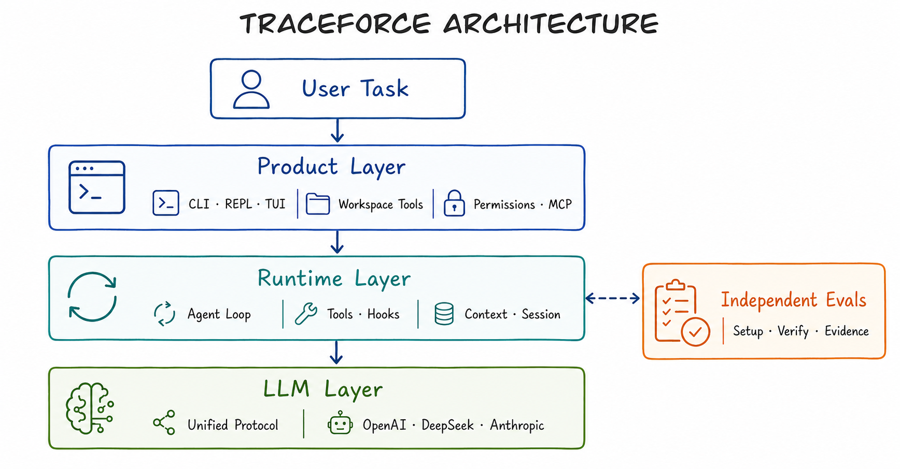
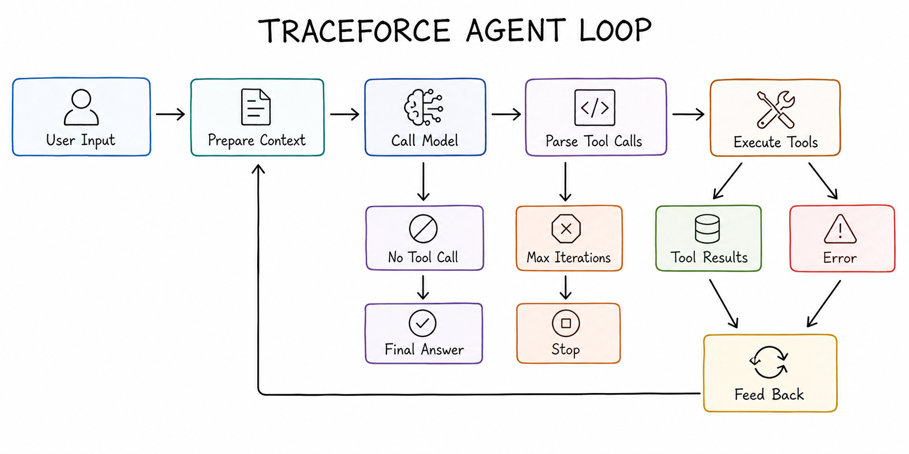
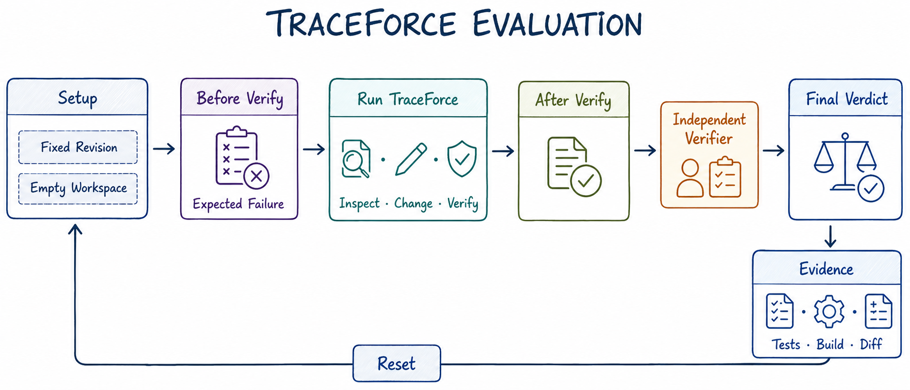

# TraceForce Coding Agent

> 面向真实软件工程任务的可验证编程智能体
>
> **由 zzz 独立设计与实现** · [GitHub](https://github.com/zzz1-zzz2/zzzagent)

[](https://www.python.org/)
[](#测试与边界)
[](#测试与边界)

TraceForce 是一个可以在本地 workspace 中自主完成编程任务的 Coding Agent：

```text
读取项目 → 分析问题 → 修改文件 → 运行验证 → 根据结果继续修复 → 汇报证据
```

它不是现成 Agent 产品的界面封装，也没有使用 Agent 框架或 Agent SDK。模型厂商 SDK 只负责 API 通信；对话历史、上下文管理、工具定义与本地执行、tool-call 解析、Agent 循环、终止条件和错误恢复均在本仓库中实现。

## 核心特色

- **完整工程闭环**：模型能够读取代码、修改文件、运行测试或构建，并根据错误继续修复；
- **自研异步运行时**：原生 `asyncio` Agent loop、工具调度、生命周期事件和终止控制；
- **受保护的本地执行**：workspace 路径边界、写操作确认、危险命令过滤、超时与取消；
- **可观察的产品界面**：CLI、REPL 和 Textual TUI，展示流式回答、工具状态、参数与结果；
- **可恢复状态**：JSONL Session、上下文裁切、大型工具结果落盘和历史恢复；
- **独立结果验证**：`evals/` 在 Agent 之外执行 verifier，不把模型的完成声明当作最终结论。

## 架构



TraceForce 按职责分成三个独立 Python 包：

| 层级 | 负责内容 | 不负责内容 |
| --- | --- | --- |
| [`traceforce`](packages/traceforce/) | CLI、TUI、Coding 工具、权限、workspace、MCP | 不复制 Agent loop |
| [`traceforce-runtime`](packages/traceforce-runtime/) | Agent loop、Tool、Session、Context、Hooks、扩展机制 | 不依赖具体 UI 和文件工具 |
| [`traceforce-llm`](packages/traceforce-llm/) | OpenAI、DeepSeek、Anthropic 协议适配与流式归一化 | 不执行工具或管理 workspace |

`evals/` 位于产品运行时之外，只负责准备固定初始状态并独立判断结果。

## 自研 Agent 循环



每轮执行包含四个关键阶段：

1. 从 Session 生成受预算约束的模型上下文；
2. 流式调用模型并聚合文本、usage 和 tool calls；
3. 校验工具参数，在本地执行工具并把成功或失败结果写回上下文；
4. 模型不再请求工具时结束；持续调用工具时由迭代上限兜底。

四个内置 Coding 工具：

| 工具 | 作用 | 默认权限 |
| --- | --- | --- |
| `read` | 分页读取 workspace 内文件 | 自动允许 |
| `write` | 创建或覆盖文件 | 执行前确认 |
| `edit` | 唯一匹配的精确文本替换 | 执行前确认 |
| `bash` | 在 workspace 根目录运行非交互命令 | 执行前确认 |

工具错误统一转换为 `ToolResult` 并反馈给模型，因此局部失败不会直接摧毁整个任务。

## 快速运行

### 环境要求

- Python 3.11+
- [uv](https://docs.astral.sh/uv/)
- 一个兼容的模型 API

### 安装

```bash
cd packages/traceforce
uv sync
```

### 配置模型

凭据只能来自环境变量或目标 workspace 内未入库的 `.env`：

```dotenv
TRACEFORCE_PROVIDER=deepseek
TRACEFORCE_MODEL=deepseek-chat
DEEPSEEK_API_KEY=
```

项目还支持 OpenAI、Anthropic 和 OpenAI-compatible gateway。不要把真实 API key 写进命令、源码、Session、日志、截图或视频。

### 启动 TUI

进入需要处理的项目目录后执行：

```bash
uv run --project /path/to/zzz-agent/packages/traceforce traceforce --tui
```

也可以运行一次性任务：

```bash
uv run --project /path/to/zzz-agent/packages/traceforce traceforce \
  "读取项目，定位问题，完成最小修改并运行测试验证"
```

常用 TUI 操作：

```text
Enter         发送任务
Ctrl+C        取消当前任务
Ctrl+Shift+C  复制选区
Ctrl+L        清除可见日志
Ctrl+Q        退出

/session      查看或切换 Session
/sessions     列出 Session
/copy         复制对话
/export       导出对话
/mcp          查看 MCP 状态
/exit         退出
```

`--yes` 只跳过 `bash`、`write`、`edit` 的人工确认，不会关闭 workspace 边界、危险命令检查或超时保护。

## 可复现评测



每个任务遵循同一条证据链：

```text
Setup → Before Verify → Run TraceForce → After Verify → Evidence → Reset
```

| 任务 | 类型 | 独立验收 |
| --- | --- | --- |
| [01 — tqdm bugfix](evals/tasks/01-tqdm-bugfix/) | 真实 Python 仓库 API 回归 | 定向 pytest + 行为断言 |
| [02 — Sanic bugfix](evals/tasks/02-sanic-bugfix/) | 真实框架 middleware 顺序错误 | registry 顺序断言 |
| [03 — DevBoard](evals/tasks/03-devboard-greenfield/) | 空 workspace 创建 React + Vite 项目 | production build + 人工 UI 验收 |

以任务 01 为例：

```bash
evals/tasks/01-tqdm-bugfix/setup.sh
evals/tasks/01-tqdm-bugfix/verify.sh  # TraceForce 介入前：预期失败

uv run --project packages/traceforce traceforce \
  --workspace "$PWD/evals/workspaces/01-tqdm-bugfix" \
  --tui \
  "Inspect the repository, fix the reported regression, and run the focused test."

evals/tasks/01-tqdm-bugfix/verify.sh  # TraceForce 完成后：独立 PASS / FAIL
```

Agent 的最后总结不能替代 verifier。任务 03 的 shell verifier 只判断可机器验证的构建契约，视觉质量单独进行浏览器人工验收。

## 测试与边界

当前三个包共包含 319 项离线测试：

```text
traceforce-llm       36
traceforce-runtime  228
traceforce           55
```

```bash
for package in traceforce-llm traceforce-runtime traceforce; do
  (cd "packages/$package" && uv lock --check && uv run python -m pytest -q && uv build)
done
```

测试使用 FakeLLM、Fake SDK、本地假 MCP server 和临时 workspace，不需要真实 API key。真实 API E2E、评测 verifier 和浏览器验收是独立证据，不能由离线测试数量替代。

当前限制：

- `bash` 是受约束的本地执行工具，不是操作系统级沙箱；
- 当前没有完整交互式 PTY；
- 第三方同步程序和 Windows 进程树不保证立即强制终止；
- typed trajectory、WorkspaceChangeTracker 和 `traceforce check` 仍在路线图中；
- 当前没有正式 PyPI 发布和完整 release automation。

## 文档

| 文档 | 内容 |
| --- | --- |
| [架构说明](docs/architecture.md) | 模块职责、Agent loop、事件和数据边界 |
| [开发指南](docs/development.md) | 本地环境、测试、构建与故障排查 |
| [评测指南](docs/evaluation.md) | 统一评测协议与证据要求 |
| [演示脚本](docs/demo.md) | 现场演示和视频录制流程 |
| [路线图](ROADMAP.md) | 尚未交付的后续能力 |

## 许可证

当前仓库尚未提供许可证文件。公开复用前请先确认授权范围。
